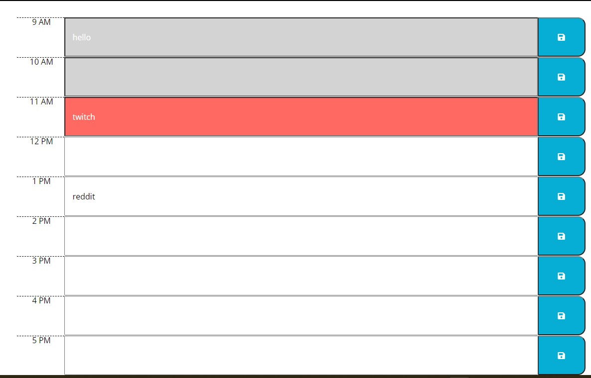

# work_day_scheduler

## User Story 

An employee with a busy schedule wants to add important events to a daily planner so they can manage my time effectively. 

## Acceptance Criteria

```
When I opening the planner the current day is displayed at the top of the calendar, and user scrolls down they are presented with timeblocks for standard business hours.
When viewing the timeblocks for that day each timeblock is color coded to indicate whether it is in the past, present, or future
When user clicks into a timeblock, user can enter an event and click save button to save to local sotrage. 
When user refreshs the page the saved events persist

```

### Screenshot 



### Github deployed page

https://gedionadamu.github.io/work_day_scheduler